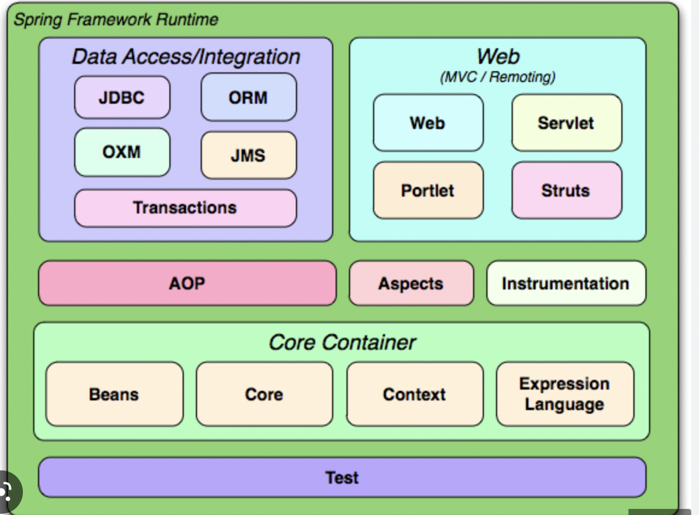

리액트 네이티브를 사용한 이유는 기존에 자바스크립트를 이용한 코드를 작성한 경험이 있기 때문이다.  
마크다운이 그리고 두번째 줄로 넘어가면 다음 줄로 인식하지 않는다. 줄을 넘어가기 전에 두번의 스페이스바를 입력해야 한다.  

그리고 이렇게 한 줄 띄우려면, 한줄 띄고 시작하면 되며, 아래의 코드를 살펴보자.
```(javascript)
    const markdown = "i dont know"
    import React from 'react'

    export default function Compoennt() {
        return (
            <div>compoennt</div>
        )
    }
```

이것을 어떻게? pre라고 하는데 어떻게 수정해야하나 모르겠다.

안되는데 안된다고
<code>코드 태그 마크다운에 잇니</code>

